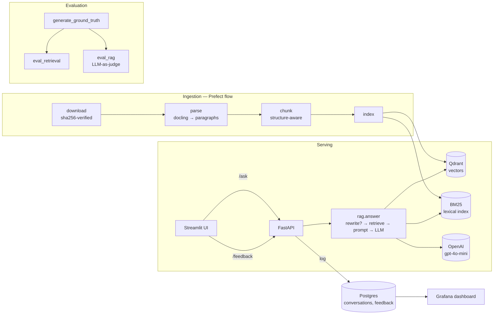

# IRB Copilot

A RAG-based Q&A assistant over public **EU prudential regulation for credit-risk
modeling** (IRB approach, definition of default, loan origination). Every answer
is grounded in the corpus and **cites its sources by document + paragraph** —
uncited answers are unacceptable in this domain.

Example questions:

- *"What does the EBA require regarding margin of conservatism in LGD estimation?"*
- *"How many days past due trigger default under the definition of default guidelines?"*
- *"What does the ECB guide say about representativeness of reference datasets?"*

> Example answer (live): *"A default is triggered … after 90 consecutive days of
> material past due amounts [ECB Guide to Internal Models (February 2024,
> consolidated), para. 66]."*

## Problem

Credit-risk analysts building IRB models must comply with dense, overlapping EU
regulation spread across thousands of numbered paragraphs (EBA guidelines, the
ECB Guide to Internal Models, the Basel framework). Finding the exact provision
that governs a modeling choice — and citing it precisely — is slow and
error-prone. IRB Copilot retrieves the relevant paragraphs and produces a
grounded, **citation-first** answer, so every claim can be traced to its source.

## Architecture



**Retrieval** offers four modes — `bm25`, `vector` (Qdrant cosine), `hybrid`
(reciprocal rank fusion), `hybrid_rerank` (cross-encoder) — all selectable by
env var. The app default (`hybrid_rerank`) is the one the de-biased evaluation
found best (see Evaluation).

## Dataset

Public regulatory PDFs, registered in [`data/sources.yaml`](data/sources.yaml)
(official URLs + pinned sha256). PDFs are **not** committed; the pipeline
downloads and verifies them.

| id | Document |
|----|----------|
| `ebagl_2017_16` | EBA Guidelines on PD estimation, LGD estimation and treatment of defaulted exposures |
| `ebagl_2020_06` | EBA Guidelines on loan origination and monitoring |
| `ebagl_2016_07` | EBA Guidelines on the application of the definition of default (Art. 178 CRR) |
| `ecb_gim_2024` | ECB Guide to Internal Models (Feb 2024, consolidated) |
| `bcbs_d424_irb` | Basel III: Finalising post-crisis reforms (IRB chapters) |
| `ebagl_2019_03` | EBA Guidelines on downturn LGD estimation |
| `ebagl_2020_05` | EBA Guidelines on credit risk mitigation for A-IRB institutions |

Parsed with **docling** (native structure: section headings, numbered
list-item markers as citation anchors, tables, footnotes dropped), yielding
**~1,600 structure-aware chunks** across the 7 documents. The pipeline (download → parse → chunk →
index) is **orchestrated with Prefect** (`ingestion/flow.py`) — each stage is a
task with retries/logging; stages are also runnable standalone via
`python -m ingestion`.

## Quick start (clone → first answer)

```bash
# 1. Install (uv; docling + reranker are default groups) and create .env
make setup
#    then edit .env and set OPENAI_API_KEY=sk-...

# 2. Start backing services (qdrant + postgres + grafana)
make up

# 3. Ingest the corpus (download → parse → chunk → index), orchestrated by Prefect.
make ingest                           # = uv run python -m ingestion.flow (~a few minutes)
#   in Docker: docker compose exec api python -m ingestion.flow

# 4a. Run the API + UI locally
make run                              # API :8000, Streamlit UI :8501

# 4b. …or run everything in containers (first build ~3.3 GB: CPU torch + docling)
docker compose up -d                  # adds api + ui services
```

The image is multi-stage (uv, non-root) and installs **CPU-only torch** — no
CUDA/nvidia packages. `docker compose` brings up all five services (qdrant,
postgres, grafana, api, ui); ingest inside the stack with
`docker compose exec api python -m ingestion.flow`.

Ask a question:

```bash
curl -s localhost:8000/ask -H 'Content-Type: application/json' \
  -d '{"question":"How many days past due trigger a default?"}' | jq .
```

Open the **UI** at http://localhost:8501 and the **Grafana** dashboard at
http://localhost:3000 (admin / admin).

## Evaluation

Reproducible; artifacts committed under [`evaluation/results/`](evaluation/results/).

### Retrieval (`eval_retrieval.py`) — hit-rate@5 / MRR@5, 800 questions

16 configs = {bm25, vector, hybrid, hybrid_rerank} × {structure, naive} × {rewrite off/on}.
Top configs ([full CSV](evaluation/results/retrieval_eval.csv),
[chart](evaluation/results/retrieval_eval.png)):

| mode | chunks | rewrite | hit@5 | MRR@5 |
|------|--------|---------|-------|-------|
| **bm25** | **structure** | **off** | **0.950** | **0.852** |
| hybrid_rerank | naive | off | 0.948 | 0.842 |
| hybrid_rerank | structure | off | 0.936 | 0.835 |
| hybrid | structure | off | 0.923 | 0.813 |
| vector | structure | off | 0.835 | 0.681 |

**Findings:** query rewriting *hurt* every config (it paraphrases away exact
regulatory terms) → `ENABLE_REWRITE=false`.

*The BM25 win was a measurement artifact.* LLM-generated questions reuse the
source's vocabulary (mean lexical overlap **0.83**), which flatters lexical
search. A **de-biased** ground truth (`--style hard`) paraphrases the questions
(overlap **0.46**) and flips the result — BM25 collapses while the semantic
methods hold up (structure chunks, no rewrite):

| mode | standard hit@5 | **de-biased** hit@5 |
|------|:---:|:---:|
| bm25 | 0.950 | 0.528 (−0.42) |
| vector | 0.835 | 0.605 |
| hybrid | 0.923 | 0.615 |
| **hybrid_rerank** | 0.936 | **0.636** |

**Chosen default: `hybrid_rerank` + structure + no rewrite** — it leads on the
realistic (paraphrased) queries a user would actually type. It adds an embedding
+ cross-encoder step, so it's slower than BM25 (a deliberate quality-for-latency
trade; set `RETRIEVAL_MODE=bm25` for the fast lexical path). Reproduce with
`make ground-truth-hard && make eval-retrieval-hard`.

### RAG (`eval_rag.py`) — LLM-as-judge, 100 questions × 4 configs

Judge (gpt-4o) labels each answer RELEVANT / PARTLY / NON and checks citation
support ([CSV](evaluation/results/rag_eval.csv),
[chart](evaluation/results/rag_eval.png)):

| model | prompt | RELEVANT | cite-ok | cost/q | latency |
|-------|--------|----------|---------|--------|---------|
| gpt-4o-mini | v1 | 0.76 | 0.69 | $0.0004 | 2.3 s |
| **gpt-4o-mini** | **v2** | **0.80** | **0.77** | **$0.0004** | **2.3 s** |
| gpt-4o | v1 | 0.81 | 0.78 | $0.0063 | 4.0 s |
| gpt-4o | v2 | 0.79 | 0.79 | $0.0067 | 9.9 s |

**Chosen default: `gpt-4o-mini` + prompt `v2`** — tied with gpt-4o on quality at
**1/16th the cost** and ~2× faster. The stricter few-shot prompt (`v2`) clearly
beats the plain one (`v1`) on the default model.

## Monitoring

Every `/ask` is logged to Postgres (`conversations`), and 👍/👎 to `feedback`.
Grafana is auto-provisioned (datasource + dashboard) with 6 panels: questions
per day, thumbs up/down ratio, cost over time, latency p50/p95, retrieval-mode
usage, and judge-relevance distribution (seeded by the RAG eval).

## Screenshots

| Streamlit UI | Grafana dashboard |
|--------------|-------------------|
|  |  |

> To capture: run `make run`, ask a question, screenshot the answer +
> sources → `docs/screenshots/ui.png`; open Grafana → the "IRB Copilot —
> Monitoring" dashboard → `docs/screenshots/grafana.png`.

## Deployment

Deploy the whole stack to a single VM with docker-compose behind a **Caddy**
reverse proxy (automatic HTTPS; only 80/443 exposed — Qdrant/Postgres/Grafana
stay on the internal network). See **[deploy/README.md](deploy/README.md)**.

```bash
sudo bash deploy/provision.sh   # install Docker + firewall (once)
cp .env.example .env            # set OPENAI_API_KEY, SITE_ADDRESS, BIND_HOST=127.0.0.1
bash deploy/deploy.sh           # build, start, ingest
# -> UI at https://<domain>/, API at /api, Grafana at /grafana
```

## Configuration

All behaviour is env-driven; see [`.env.example`](.env.example) for every
variable. Defaults encode the evaluation winners (bm25 / structure / no rewrite /
gpt-4o-mini / prompt v2). Model access goes through `app/providers.py`, so
swapping providers/models is an env change.

## Development

```bash
make test     # pytest (73 tests)
make lint     # ruff
make fmt      # ruff format
```

Layout: `ingestion/` (pipeline stages + Prefect `flow.py`), `app/` (config,
providers, retrieval, rewrite, prompts, rag, api, ui), `evaluation/` (ground
truth + retrieval/RAG eval), `monitoring/` (db + Grafana provisioning).
Notebook: `notebooks/experiments.ipynb`.

## Rubric mapping (SPEC §15)

| Criterion | Where |
|-----------|-------|
| Problem described | This README (Problem) |
| RAG flow: knowledge base + LLM | `app/rag.py` (retrieve → prompt → LLM) |
| Retrieval: multiple approaches evaluated, best used | `app/retrieval.py` (4 modes), `evaluation/eval_retrieval.py`, default = winner |
| LLM: multiple prompts/models evaluated, best used | `app/prompts.py` (v1/v2), `evaluation/eval_rag.py`, default = winner |
| Interface: UI + API | `app/ui.py` (Streamlit) + `app/api.py` (FastAPI) |
| Ingestion: automated pipeline (special tool) | **Prefect** flow `ingestion/flow.py` (`make ingest`); stages in `ingestion/pipeline.py` |
| Monitoring: feedback + dashboard (5+ panels) | `/feedback`, `monitoring/db.py`, Grafana (6 panels) |
| Containerization | full `docker-compose.yml` (qdrant, postgres, grafana, api, ui) + multi-stage `Dockerfile` (uv, non-root, CPU-only torch); build verified end-to-end |
| Deployment | VM deploy via `deploy/` — production compose overlay behind a Caddy TLS proxy, provisioning + deploy scripts, [runbook](deploy/README.md) |
| Reproducibility | `make setup`, auto-download + sha256, `uv.lock` pins all versions, committed eval results |
| Best practices: hybrid search / re-ranking / query rewriting | all implemented (`retrieval.py`, `rewrite.py`) and evaluated |

See [SPEC.md](SPEC.md) for the full specification.
